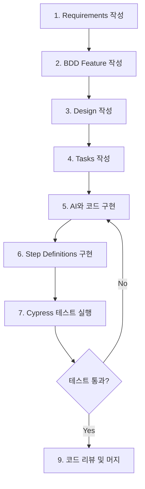

# Spec-Driven Development (SDD) 가이드

이 프로젝트는 **Spec-Driven Development (명세 주도 개발)** 방법론을 따릅니다.  
명세서를 중심으로 개발을 진행하며, AI 코딩 어시스턴트와 협업하여 효율적이고 일관된 코드를 생성합니다.

## 📋 목차

1. [SDD란?](#sdd란)
2. [개발 워크플로우](#개발-워크플로우)
3. [디렉토리 구조](#디렉토리-구조)
4. [명세서 작성 규칙](#명세서-작성-규칙)
5. [AI와 협업하기](#ai와-협업하기)
6. [체크리스트](#체크리스트)

---

## 🎯 SDD란?

**Spec-Driven Development**는 코드를 작성하기 전에 명확한 명세서를 먼저 작성하는 개발 방법론입니다.

### 핵심 원칙

1. **무엇(What)** 을 먼저 정의하고, **어떻게(How)** 는 나중에
2. 명세서는 **실행 가능한 문서**로 작성
3. AI가 이해할 수 있는 **구조화된 형식**으로 작성
4. 명세서는 **단일 진실 공급원(Single Source of Truth)**

### SDD의 장점

- ✅ 개발 속도 향상 (AI 활용)
- ✅ 코드 품질과 일관성 향상
- ✅ 팀 간 원활한 의사소통
- ✅ 문제의 사전 발견
- ✅ 명확한 개발 방향성

---

## 🔄 개발 워크플로우

### 필수 순서 (중요!)

```
1. Requirements (요구사항)
   │
   ├─> 무엇을 만들 것인가?
   └─> 왜 필요한가?
   
2. Design (설계)
   │
   ├─> 어떻게 구조화할 것인가?
   └─> 기술적으로 어떻게 구현할 것인가?
   
3. Tasks (작업)
   │
   ├─> 구체적인 구현 단계는?
   └─> AI에게 전달할 명세는?
```

> ⚠️ **중요**: 반드시 **Requirements → Design → Tasks** 순서로 작성해야 합니다.
> 
> - Requirements를 먼저 확인하지 않고 Design을 작성하지 마세요
> - Design을 먼저 확인하지 않고 Tasks를 작성하지 마세요

### 상세 워크플로우



### 단계별 상세 설명

#### 1단계: Requirements (요구사항 명세)

**목적**: 비즈니스 요구사항과 사용자 스토리 정의

**작성 내용**:
- 프로젝트 개요
- 핵심 가치 제안
- 사용자 스토리 (User Stories)
- 수용 기준 (Acceptance Criteria)
- 비기능 요구사항 (성능, 보안 등)

**작성 위치**: `specs/requirements/`

**예시**:
```markdown
# US-001: 사용자 로그인

**As a** 환전 서비스 사용자  
**I want to** 이메일과 비밀번호로 로그인할 수 있다  
**So that** 내 계정으로 환전 서비스를 이용할 수 있다

**Acceptance Criteria:**
- [ ] 이메일과 비밀번호 입력 필드가 있어야 함
- [ ] 유효하지 않은 이메일 형식은 에러 메시지 표시
- [ ] 로그인 실패 시 명확한 에러 메시지 표시
```

#### 2단계: BDD Feature (행동 명세)

**목적**: 요구사항을 Gherkin 문법으로 테스트 가능한 시나리오로 작성

**작성 내용**:
- Feature 정의
- Background (공통 전제조건)
- Scenario (테스트 시나리오)
- Given-When-Then 스텝

**작성 위치**: `cypress/features/`

**예시**:
```gherkin
Feature: 사용자 로그인

  Scenario: 유효한 자격증명으로 로그인 성공
    Given 로그인 페이지에 접속한다
    When 이메일 "user@example.com"을 입력한다
    And 비밀번호 "password123"을 입력한다
    And 로그인 버튼을 클릭한다
    Then 대시보드 페이지로 이동한다
```

#### 3단계: Design (설계 명세)

**목적**: 시스템 아키텍처와 기술적 설계 정의

**작성 내용**:
- 아키텍처 설계 (Feature Sliced Design)
- API 명세 (엔드포인트, 요청/응답 형식)
- 데이터 모델 (타입, 인터페이스)
- 상태 관리 전략
- UI/UX 설계
- 네이밍 컨벤션

**작성 위치**: `specs/design/`

**예시**:
```markdown
## API Endpoint: POST /auth/login

**Request:**
{
  email: string;
  password: string;
}

**Response (200):**
{
  user: { id: string; email: string; name: string; };
  accessToken: string;
}
```

#### 4단계: Tasks (작업 명세)

**목적**: 구체적인 구현 단계와 AI 프롬프트 작성

**작성 내용**:
- 구현할 파일 목록
- 각 파일의 상세 스펙
- 구현 순서
- AI 프롬프트 예시
- 완료 조건 (Definition of Done)

**작성 위치**: `specs/tasks/`

**예시**:
```markdown
### Step 1: Login Feature 구현

**파일**: `src/features/auth/login/ui/LoginForm.tsx`

**구현 요구사항:**
- React 19와 TypeScript 사용
- React Query를 사용한 비동기 상태 관리
- Tailwind CSS 4로 스타일링
- data-testid 속성 포함

**AI 프롬프트:**
> 이 명세서를 기반으로 LoginForm 컴포넌트를 구현해줘.
> 명세서: specs/tasks/feature-001-auth.md
```

#### 5-9단계: 구현 및 테스트

실제 코드 구현, 테스트 작성 및 실행, 코드 리뷰

---

## 📁 디렉토리 구조

```
specs/
├── README.md                    # 이 문서
├── requirements/                # 1단계: 요구사항 명세
│   ├── 01-project-overview.md   # 프로젝트 개요
│   ├── 02-user-stories.md       # 사용자 스토리
│   └── 03-non-functional.md     # 비기능 요구사항
├── design/                      # 2단계: 설계 명세
│   ├── architecture.md          # 아키텍처 설계
│   ├── api-spec.md              # API 명세
│   ├── data-models.md           # 데이터 모델
│   └── ui-components.md         # UI 컴포넌트 설계
└── tasks/                       # 3단계: 작업 명세
    ├── feature-001-auth.md      # 인증 기능 작업 명세
    ├── feature-002-exchange.md  # 환전 기능 작업 명세
    └── feature-003-dashboard.md # 대시보드 작업 명세
```

---

## 📝 명세서 작성 규칙

### 1. Requirements 작성 규칙

#### 파일명 규칙
- `01-project-overview.md` - 프로젝트 전체 개요
- `02-user-stories.md` - 사용자 스토리 모음
- `03-non-functional.md` - 비기능 요구사항

#### 사용자 스토리 형식
```markdown
# US-XXX: [기능명]

**As a** [사용자 유형]  
**I want to** [원하는 기능]  
**So that** [기대 효과]

**Acceptance Criteria:**
- [ ] 기준 1
- [ ] 기준 2
- [ ] 기준 3

**Priority**: High | Medium | Low
**Estimate**: [개발 예상 시간]
```

#### 필수 포함 요소
- ✅ 명확한 사용자 관점
- ✅ 측정 가능한 수용 기준
- ✅ 우선순위 명시
- ✅ 연관 문서 링크

### 2. Design 작성 규칙

#### 파일명 규칙
- `architecture.md` - Feature Sliced Design 구조
- `api-spec.md` - API 엔드포인트 명세
- `data-models.md` - TypeScript 타입 정의
- `ui-components.md` - 컴포넌트 설계

#### API 명세 형식
```markdown
### [METHOD] /endpoint

**설명**: [엔드포인트 설명]

**Request:**
\`\`\`typescript
interface RequestType {
  field: type;
}
\`\`\`

**Response (200):**
\`\`\`typescript
interface ResponseType {
  field: type;
}
\`\`\`

**Errors:**
- 400: Bad Request
- 401: Unauthorized
- 404: Not Found
```

#### 컴포넌트 설계 형식
```markdown
## ComponentName

**위치**: `src/[layer]/[slice]/ui/ComponentName.tsx`

**Props:**
\`\`\`typescript
interface ComponentProps {
  prop1: type;
  prop2?: type;
}
\`\`\`

**상태**: [사용하는 상태 설명]
**의존성**: [의존하는 다른 컴포넌트/훅]
```

### 3. Tasks 작성 규칙

#### 파일명 규칙
- `feature-XXX-[name].md` - 기능별 작업 명세
- XXX는 3자리 숫자 (001, 002, ...)

#### 작업 명세 형식
```markdown
# Task: [작업명]

## 연관 문서
- Requirements: `specs/requirements/XX-xxx.md` (US-XXX)
- Design: `specs/design/xxx.md`
- Feature: `cypress/features/xxx.feature`

## 작업 범위
[이 작업에서 구현할 내용 요약]

## 구현 단계

### Step 1: [단계명]
**파일**: `경로/파일명`

- [ ] 체크리스트 1
- [ ] 체크리스트 2

**상세 스펙:**
\`\`\`typescript
// 코드 예시 또는 타입 정의
\`\`\`

**AI 프롬프트:**
\`\`\`
[AI에게 전달할 구체적인 지시사항]
\`\`\`

### Step 2: ...

## 완료 조건 (Definition of Done)
- [ ] 모든 컴포넌트 구현 완료
- [ ] TypeScript 타입 에러 없음
- [ ] ESLint 에러 없음
- [ ] BDD 테스트 모두 통과
- [ ] 코드 리뷰 완료
```

---

## 🤖 AI와 협업하기

### AI에게 명세서 제공하기

#### 1. 컨텍스트 제공
```
@specs/requirements/02-user-stories.md
@specs/design/architecture.md
@specs/tasks/feature-001-auth.md

위 명세서를 기반으로 src/features/auth/login/ui/LoginForm.tsx를 구현해줘.
```

#### 2. 구체적인 요구사항 명시
```
요구사항:
- React 19와 TypeScript 사용
- React Query를 사용한 비동기 상태 관리
- Tailwind CSS 4로 스타일링
- 이메일과 비밀번호 유효성 검사
- 로딩 상태 표시
- 에러 핸들링
- data-testid 속성 포함 (Cypress 테스트용)
```

#### 3. 코딩 스타일 지정
```
코딩 스타일:
- Feature Sliced Design 아키텍처 준수
- 함수형 컴포넌트 사용
- 네이밍: camelCase (함수), PascalCase (컴포넌트)
- 주석: JSDoc 형식
```

### AI 프롬프트 템플릿

#### 컴포넌트 생성
```
다음 명세를 기반으로 [컴포넌트명]을 구현해줘:

**명세 위치**: 
- Requirements: specs/requirements/XX-xxx.md (US-XXX)
- Design: specs/design/xxx.md
- Task: specs/tasks/feature-XXX-xxx.md

**구현 요구사항**:
1. [요구사항 1]
2. [요구사항 2]
3. [요구사항 3]

**Props 타입**:
```typescript
interface Props {
  // 타입 정의
}
```

**파일 위치**: src/[경로]

Feature Sliced Design 원칙을 준수하고, TypeScript와 Tailwind CSS를 사용해줘.
```

#### API 함수 생성
```
다음 API 명세를 기반으로 API 함수를 구현해줘:

**API 명세**: specs/design/api-spec.md의 [엔드포인트명]

**요구사항**:
- React Query의 useMutation/useQuery 사용
- 에러 핸들링 포함
- TypeScript 타입 안정성

**파일 위치**: src/entities/[entity]/api/[name].ts
```

#### 테스트 Step Definitions 생성
```
다음 Feature 파일의 Step Definitions를 구현해줘:

**Feature 파일**: cypress/features/[name].feature

**요구사항**:
- @badeball/cypress-cucumber-preprocessor 사용
- 재사용 가능한 커스텀 커맨드 활용
- data-testid로 요소 선택
- 명확한 에러 메시지

**파일 위치**: cypress/e2e/[name].steps.ts
```

---

## ✅ 체크리스트

### 새 기능 개발 시

#### Phase 1: Requirements
- [ ] 사용자 스토리 작성 (`specs/requirements/`)
- [ ] 수용 기준 명시
- [ ] 우선순위 설정
- [ ] 이해관계자 검토

#### Phase 2: BDD Feature
- [ ] Feature 파일 작성 (`cypress/features/`)
- [ ] Given-When-Then 시나리오 작성
- [ ] 다양한 테스트 케이스 포함

#### Phase 3: Design
- [ ] 아키텍처 설계 (`specs/design/architecture.md`)
- [ ] API 명세 작성 (`specs/design/api-spec.md`)
- [ ] 데이터 모델 정의 (`specs/design/data-models.md`)
- [ ] UI 컴포넌트 설계 (`specs/design/ui-components.md`)

#### Phase 4: Tasks
- [ ] 작업 명세 작성 (`specs/tasks/feature-XXX-xxx.md`)
- [ ] 구현 단계 세분화
- [ ] AI 프롬프트 준비
- [ ] 완료 조건 명시

#### Phase 5: Implementation
- [ ] AI와 협업하여 코드 구현
- [ ] TypeScript 타입 에러 해결
- [ ] ESLint 에러 해결
- [ ] 컴포넌트 스토리북 작성 (선택)

#### Phase 6: Testing
- [ ] Step Definitions 구현
- [ ] Cypress 테스트 실행
- [ ] 모든 시나리오 통과 확인
- [ ] Edge case 테스트

#### Phase 7: Review
- [ ] 명세서와 구현 일치 확인
- [ ] 코드 리뷰
- [ ] 문서 업데이트
- [ ] 머지

---

## 📚 참고 자료

### 내부 문서
- [Cypress BDD 테스트 가이드](../cypress/README.md)
- [Feature Sliced Design](https://feature-sliced.design/)

### 외부 자료
- [Spec-Driven Development 소개](https://tilnote.io/pages/68c89bae13bac2acb24a0a18)
- [GitHub Spec Kit](https://github.com/github/spec-kit)
- [Gherkin 문법 가이드](https://cucumber.io/docs/gherkin/reference/)
- [BDD Best Practices](https://cucumber.io/docs/bdd/)

---

## 💡 팁

### 좋은 명세서 작성법
1. **구체적이고 측정 가능하게**: 모호한 표현 피하기
2. **AI가 이해할 수 있게**: 구조화된 형식 사용
3. **실행 가능하게**: 바로 코드로 옮길 수 있을 정도로 상세하게
4. **일관성 유지**: 네이밍과 스타일 일관되게

### 피해야 할 것
- ❌ 구현 세부사항을 Requirements에 포함
- ❌ Design 없이 바로 코드 작성
- ❌ 테스트 시나리오 누락
- ❌ 명세서와 코드의 불일치

### SDD 성공의 열쇠
- 🔑 **명세서를 최신 상태로 유지**: 코드 변경 시 명세서도 업데이트
- 🔑 **작은 단위로 나누기**: 한 번에 너무 많은 것을 하지 않기
- 🔑 **반복적 개선**: 피드백을 반영하여 지속적으로 개선
- 🔑 **팀과 공유**: 명세서를 통해 지식 공유

---

**마지막 업데이트**: 2025-10-27  
**버전**: 1.0.0

